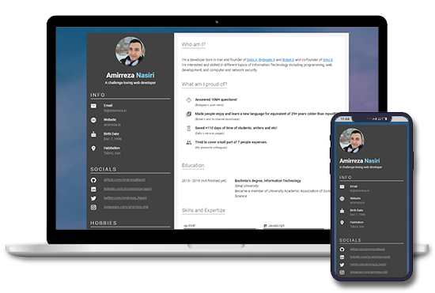

<h1 align="center">
  <br>
  <a target="_blank" href="https://ryancwynar.com/resume/">
    
  </a>
  <br>
  Vue Resume
  <br>
</h1>

<h4 align="center">
  🚀 See yourself:
  <a href="https://ryancwynar.com/resume">
     Demo
  </a>
</h4>


## What is Vue Modern Resume?
Vue Modern Resume is basically a simple (yet easy to setup) resume template based on <a href="https://vuejs.org/">Vue.js</a> framework and <a href="https://vuetifyjs.com/">Vuetify</a> UI toolkit.


## How to use

1. Clone this repository.
```
git clone https://github.com/RyanCwynar/vue-resume
```

1. Go to the cloned directory (e.g. `cd vue-resume`).

2. Run `npm install`.

3. Customize your resume

4. Preview resume with `npm serve`.

5. Build it with `npm build`.

## License
Code is licensed under the [MIT License](LICENSE).
